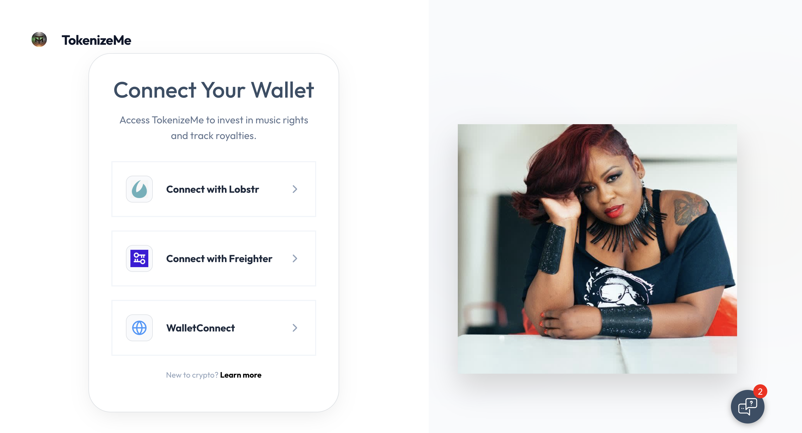
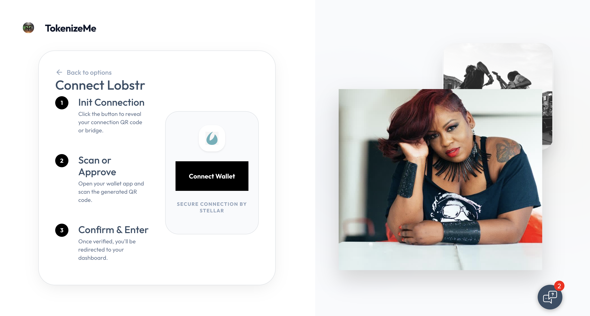
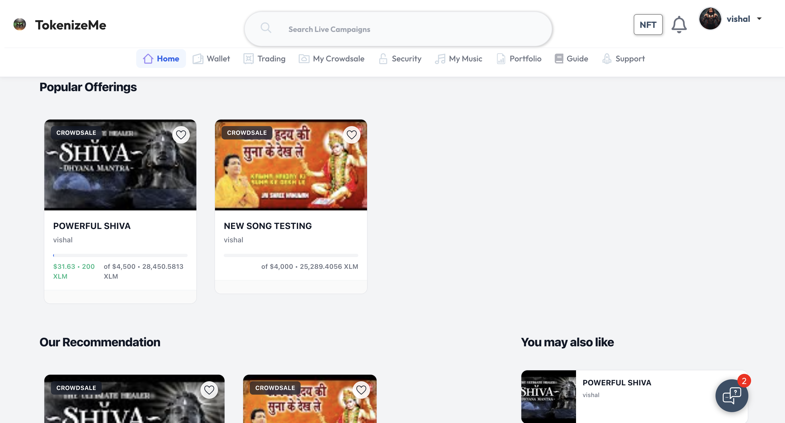
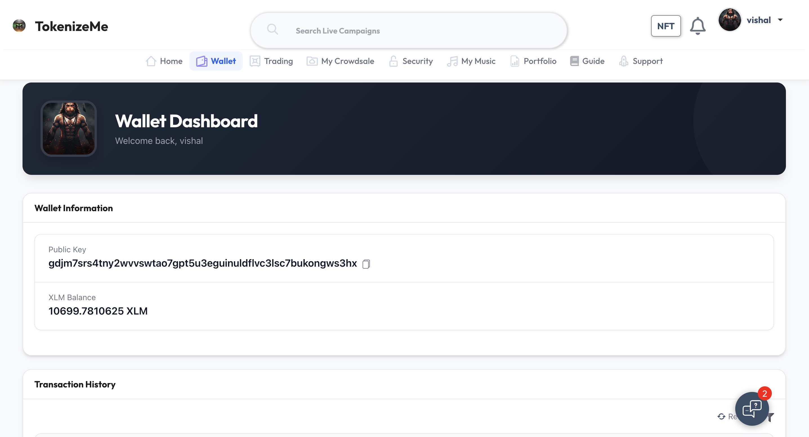
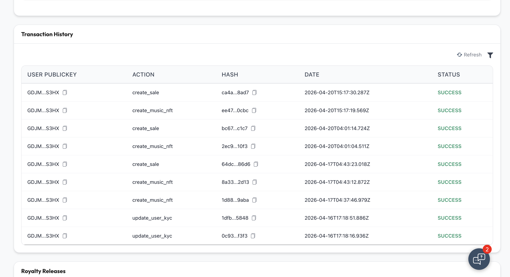
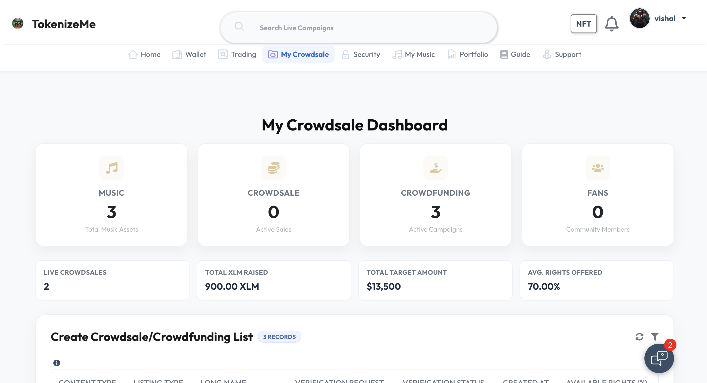
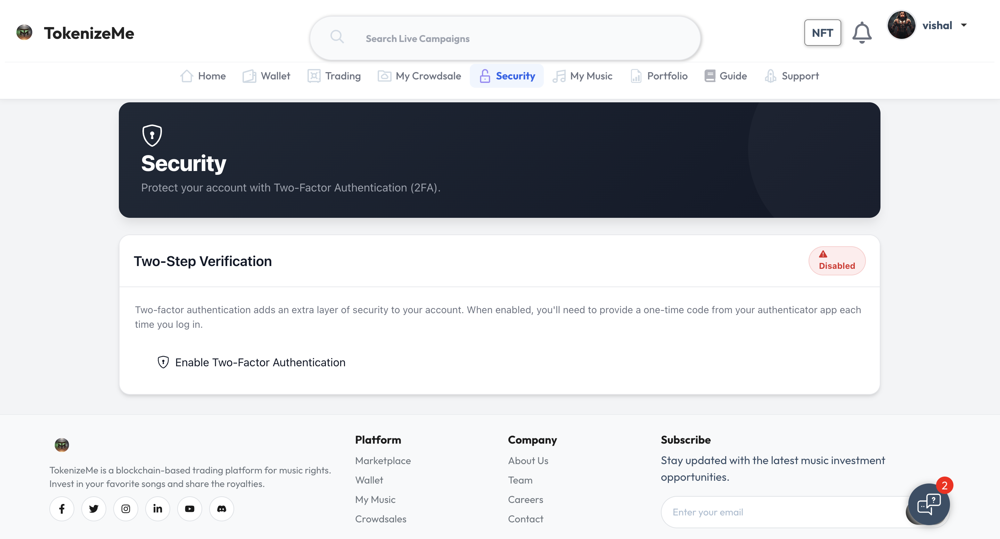
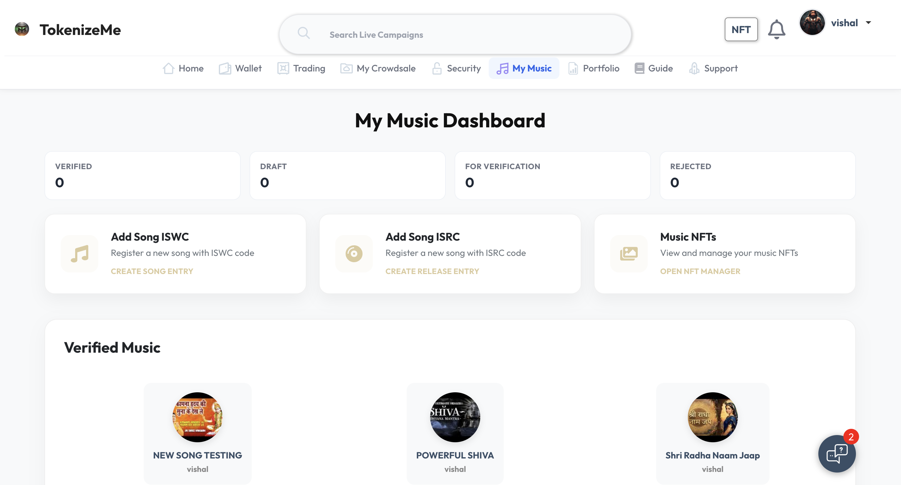

# TokenizeMe Public Showcase

[](https://stellar.org/soroban)
[](https://www.typescriptlang.org/)
[](https://nodejs.org/)
[](./LICENSE)
[](#)

TokenizeMe is a tokenization platform for music rights and real-world assets built on Stellar and Soroban. This public repository is designed for grant reviewers, partners, and technical evaluators who need a clear view of the product architecture, integration model, and engineering approach without exposing sensitive production code, operational infrastructure, or proprietary business logic.

## Project Summary

TokenizeMe enables asset issuers to create tokenized offerings, launch compliant fundraising campaigns, and manage fractional ownership using Soroban smart contracts and a backend orchestration layer. The platform is designed to bridge regulated off-chain workflows such as identity verification, asset metadata management, and operational reporting with transparent on-chain ownership, transfers, and settlement.

### What problem it solves

- Makes tokenized asset issuance easier for non-crypto-native businesses
- Reduces operational friction between compliance workflows and blockchain settlement
- Enables fractional participation in music and broader RWA opportunities
- Provides a programmable foundation for primary issuance, ownership tracking, and lifecycle events

### Who it is for

- Music rights issuers and creators
- RWA originators and investment platforms
- Investors and community participants
- Partners evaluating tokenization infrastructure on Stellar

### Key differentiators

- Built around Stellar and Soroban for low-cost, fast finality, and predictable infrastructure
- Combines on-chain tokenization with off-chain compliance and issuer workflows
- Supports tokenized offerings, fractional positions, and sale lifecycle management
- Designed for production deployment with a private codebase and a controlled security model

## Why This Repository Is Public

This repository is a public showcase of the system architecture, product direction, and selected example implementations. The production repository remains private for security, infrastructure protection, compliance controls, and intellectual property reasons.

What is included here:

- public-safe architecture documentation
- sample API patterns
- placeholder service structure
- illustrative contract integration examples
- roadmap and implementation notes

What is intentionally excluded:

- secrets, credentials, and environment-specific configuration
- internal operational tooling
- proprietary business rules and settlement logic
- production contract deployment details
- sensitive integrations and internal admin functionality

## Repository Structure

```text
tokenizeme-public-showcase/
├── .github/
│   ├── ISSUE_TEMPLATE/
│   │   ├── bug_report.md
│   │   └── feature_request.md
│   ├── pull_request_template.md
│   └── workflows/
│       └── ci.yml
├── assets/
│   └── screenshots/
│       └── README.md
├── docs/
│   ├── api-examples.md
│   ├── architecture.md
│   ├── roadmap.md
│   ├── security-model.md
│   └── workflow.md
├── examples/
│   ├── api-client.ts
│   ├── contract-flow.ts
│   └── webhook-handler.ts
├── openapi/
│   └── openapi.public.yaml
├── src/
│   ├── config.ts
│   ├── index.ts
│   ├── modules/
│   │   ├── issuer/
│   │   │   └── createOffering.ts
│   │   ├── settlements/
│   │   │   └── finalizeSale.ts
│   │   └── wallet/
│   │       └── getPortfolio.ts
│   └── services/
│       ├── publicApi.ts
│       └── sorobanGateway.ts
├── .env.example
├── CHANGELOG.md
├── .gitignore
├── CONTRIBUTING.md
├── LICENSE
├── package.json
├── tsconfig.json
└── README.md
```

## Architecture Overview

The production platform follows a layered architecture:

1. Frontend clients for issuer, investor, and admin experiences
2. API and orchestration layer built with Node.js and Express
3. Soroban smart contracts written in Rust for tokenization and sale lifecycle logic
4. Data and operations layer for compliance state, metadata, reporting, and audit support

For a detailed breakdown, see [docs/architecture.md](./docs/architecture.md).

## Public Demo Surfaces

This repository includes public-facing materials that are useful in a grant or investor review:

- product screenshots in [`assets/screenshots`](./assets/screenshots/README.md)
- sample API requests in [docs/api-examples.md](./docs/api-examples.md)
- public OpenAPI definition in [openapi/openapi.public.yaml](./openapi/openapi.public.yaml)
- workflow diagrams and lifecycle notes in [docs/workflow.md](./docs/workflow.md)

### Platform Screenshots

#### Wallet onboarding





#### Marketplace and investor experience







#### Issuer and platform operations







## Quick Start

This repository is intentionally lightweight. It is not the production system; it is a public-safe technical showcase with example code and documentation.

### Requirements

- Node.js 20+
- npm 10+

### Installation

```bash
npm install
cp .env.example .env
npm run dev
```

### Available scripts

```bash
npm run dev
npm run build
npm run typecheck
npm run lint
```

## Public API Surface

The example API surface demonstrates how the platform is organized without exposing private internals.

Representative endpoints:

- `POST /api/v1/offerings`
- `GET /api/v1/offerings/:offeringId`
- `POST /api/v1/investments`
- `GET /api/v1/portfolio/:walletAddress`
- `POST /api/v1/webhooks/settlement`

See [docs/api-examples.md](./docs/api-examples.md) for sample requests and responses.

## Soroban Integration

TokenizeMe uses Soroban as the core smart-contract layer for:

- issuer registration and offering creation
- tokenized asset metadata references
- fractional ownership issuance
- sale lifecycle management
- position tracking and settlement primitives

The example files in [`src/services/sorobanGateway.ts`](./src/services/sorobanGateway.ts) and [`examples/contract-flow.ts`](./examples/contract-flow.ts) show the public-safe interaction pattern.

## Roadmap

Near-term product and engineering priorities are documented in [docs/roadmap.md](./docs/roadmap.md). Current focus areas include:

- hardened issuer onboarding flows
- expanded asset class support
- improved settlement transparency
- stronger developer-facing documentation
- ecosystem integrations on Stellar

## Security and Private Production Repository

The live production system remains private by design.

Short version:

> TokenizeMe maintains a separate private production repository containing operational infrastructure, security controls, deployment configuration, proprietary business logic, and restricted integrations. This public repository is intended for transparency, technical evaluation, and ecosystem collaboration without increasing attack surface or disclosing protected IP.

Additional notes are available in [docs/security-model.md](./docs/security-model.md).

## Contributing

External contributions to the public showcase are welcome for documentation, public-safe examples, and non-sensitive tooling improvements. See [CONTRIBUTING.md](./CONTRIBUTING.md).

## License

This public showcase repository is released under the MIT License. See [LICENSE](./LICENSE).

## Suggested GitHub Topics

`stellar` `soroban` `tokenization` `rwa` `music-tech` `fintech` `blockchain` `typescript` `rust` `web3`

## Grant / Investor Ready Description

TokenizeMe is a Stellar-powered tokenization platform that helps issuers launch compliant digital asset offerings for music rights and real-world assets. The system combines Soroban smart contracts with an operational backend to manage issuance, fundraising, ownership accounting, and settlement while keeping compliance and business workflows practical for real-world deployment.

## Signals of Active Maintenance

To help this repository look credible and current:

- keep the roadmap updated every month
- publish architecture revisions as the system evolves
- maintain a changelog or release notes
- add sanitized screenshots and demo recordings
- keep CI green on the public example code
- document milestones, test coverage goals, and public issues
